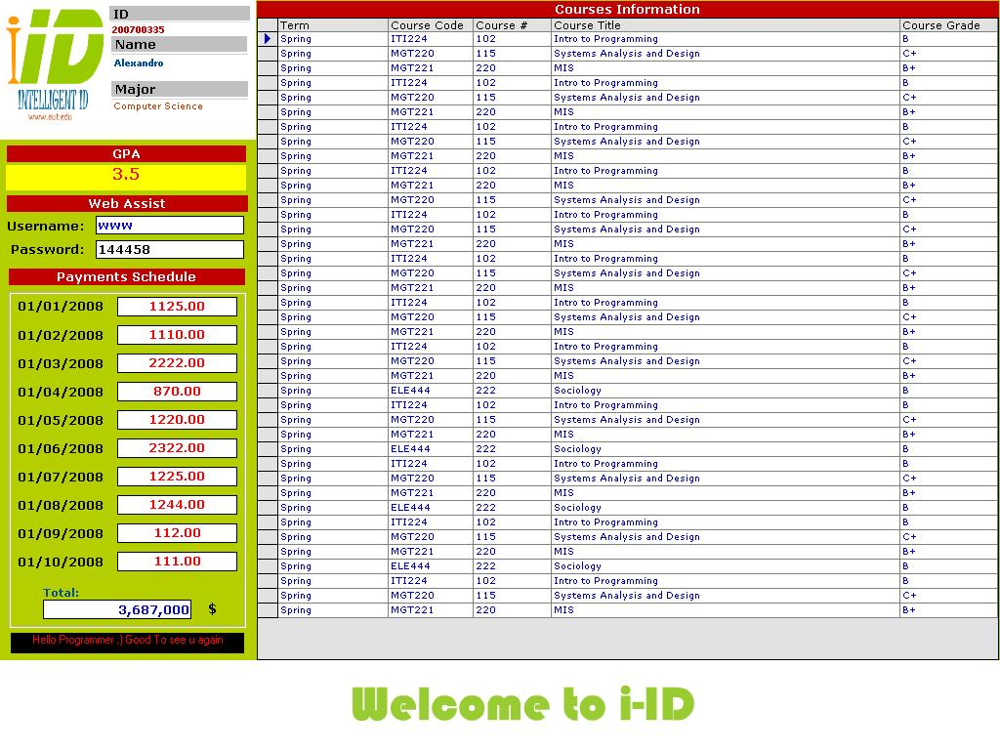



## AUT \- Intelligent ID System

### Description

American University Of Technology - Intelligent ID System Ver 1.0

----

Hello everyone,

this is a project I made for my university AUT, this system accepts the Barcode that's printed on the student ID and displays his courses and Payments information in addition to other info.

What you can learn from this project?

----

1- Using ADO pure code to manipulate database

2- Using the flash activeX object

3- Using the INI routines to get and save data/options.

4- Barcode idea

How to use the system

----

please add some info to the database and espacially the ID number

I've added a sample ID

When you run the system a flash screen will display:type in the keyboard the following number : 200700335 and then press enter

and see what happens ;)

and try to enter anyother number and also see what happens

Note:don't click on the flash this will un-focus on the Barcode text box

This system is best used with only a keyboard.

To login enter your ID + enter

to logout re-enter your ID + enter

to exit the system type 123456789 + enter

THIS SYSTEM IS OPEN SOURCE AND FREE-OF-CHARGE YOU CAN USE IT ONLY FOR EDUCATIONAL PURPOSES.
 
### More Info
 

             |
---                |---
**Submitted On**   |2008-06-04 16:57:54
**By**             |[Majed A\.Khaznadar](https://github.com/Planet-Source-Code/PSCIndex/blob/master/ByAuthor/majed-a-khaznadar.md)
**Level**          |Intermediate
**User Rating**    |4.0 (8 globes from 2 users)
**Compatibility**  |VB 6\.0
**Category**       |[Complete Applications](https://github.com/Planet-Source-Code/PSCIndex/blob/master/ByCategory/complete-applications__1-27.md)
**World**          |[Visual Basic](https://github.com/Planet-Source-Code/PSCIndex/blob/master/ByWorld/visual-basic.md)
**Archive File**   |[AUT\_\-\_Inte2125098292008\.zip](https://github.com/Planet-Source-Code/majed-a-khaznadar-aut-intelligent-id-system__1-71017/archive/master.zip)

